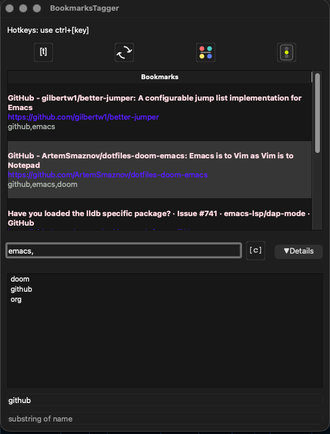

# BookmarksTagger

Desktop app (PySide6) for searching, tagging, and opening Safari bookmarks on macOS.

## Platform
- macOS only (uses Safari bookmarks and AppleScript) 

## Prerequisites
- macOS with Safari (reads `~/Library/Safari/Bookmarks.plist`; macOS creates it after Safari is opened once)
- Python 3.10+ (tested with 3.11.9, 3.12.6, 3.13.8)

## Setup
```bash
git clone --depth 1 https://github.com/m03dtb/safari-bookmarks-tagger.git
cd BookmarksTagger
python -m venv venv
source venv/bin/activate
pip install -r requirements.txt
```

## Run
```bash
python main.py
```

## Notes
- Icons and `tags.json` resolve relative to the project path, so starting from any CWD works.
- If `Bookmarks.plist` is missing, the app shows a notice; open Safari once, then reload.

## Tests
Run the small pytest suite for helper logic and the Safari status wrapper:
```bash
# pytest is included in requirements.txt
python -m pytest
```

## Usage 
Please consider that creating and deleting bookmarks still has to be done within Safari.

### Creating new tags
Immediately after a new bookmark is created in Safari, a window for entering tags for 
the new bookmark opens automatically.

### Updating Safari bookmarks 
The entries in the tags.json are updated when calling load_tags() so Bookmarks deleted in Safari will 
no longer be available in the app as intended.

### Hotkeys
- Ctrl+R: reload Safari bookmarks
- Ctrl+T: open/close tag window
- Ctrl+S: focus search bar; Enter applies first suggested tag
- Ctrl+C: clear tag search (not URL/name filters)
- Ctrl+X: open selected bookmarks in new Safari tabs
- Ctrl+I: invert tag selection (in tag window)
- Ctrl+D: delete selected tags (in tag window)

- Cmd+Mouse click: multi-select bookmark rows

### Buttons
- Lights: Off / GUI / GUI + menu bar icon; checks every 2s if frontmost Safari tab is bookmarked (green: exact, yellow: domain, red: none). Default: GUI+menu bar icon.
- Color: set display colors for Name/URL/Tags.
- Details: show URL/Name substring filters next to tag search.

## Third-Party Licenses
This project uses the following open-source components:
- PySide6 (LGPL-3.0) – https://wiki.qt.io/Qt_for_Python
- RapidFuzz (MIT) – https://github.com/maxbachmann/RapidFuzz



